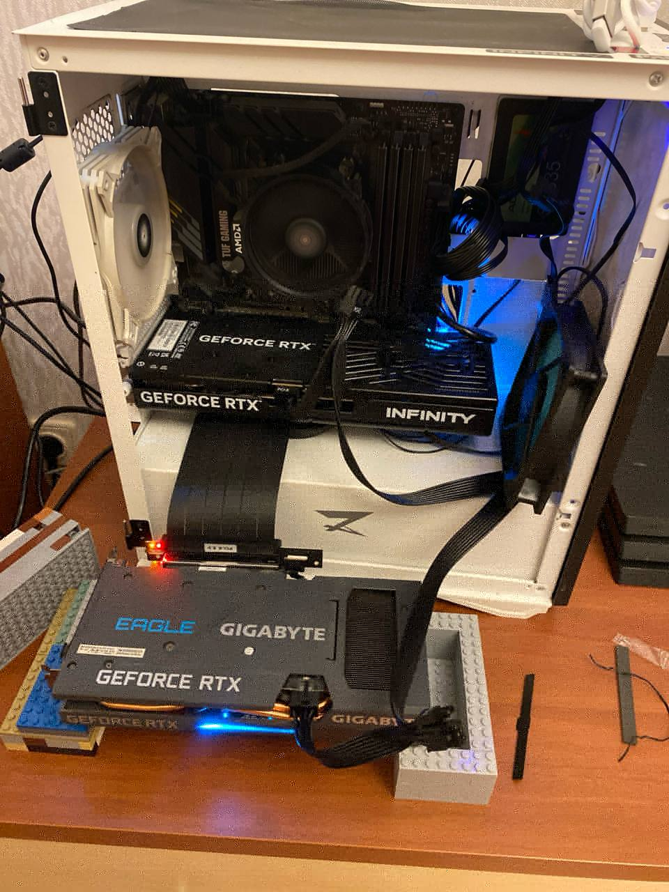
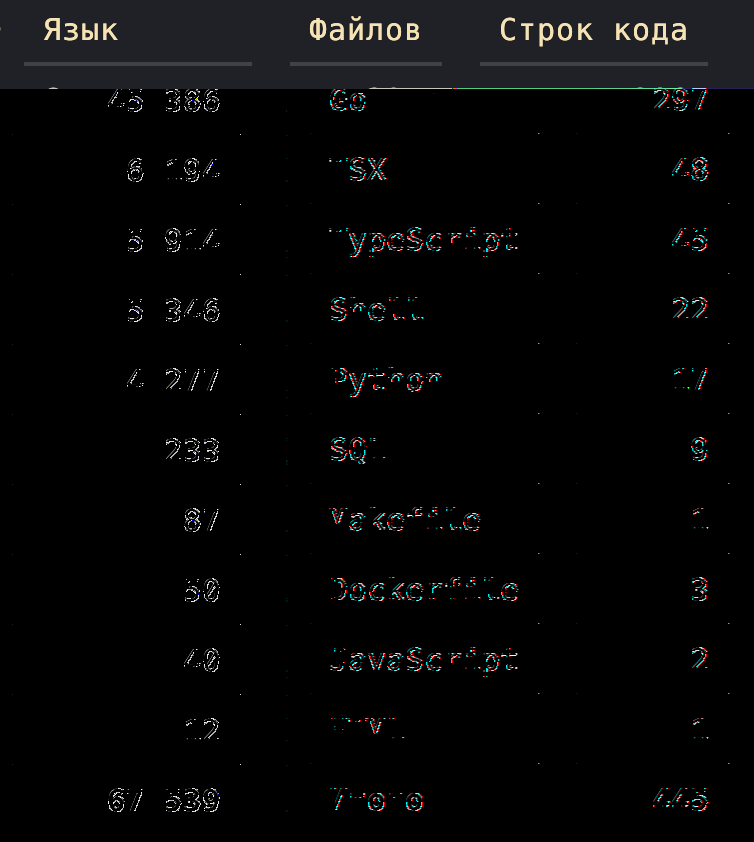

> Оригинальная публикация: [Хабр](https://habr.com/ru/articles/1049412/). Английская версия опубликована на [Medium](https://medium.com/@andreygaag/i-ran-a-coding-agent-on-two-consumer-gpus-speed-wasnt-the-bottleneck-2b63c66ec56d).

В последнее время большинство обсуждений агентской разработки крутится вокруг Claude Code, Codex, Gemini CLI и других облачных инструментов. Но, с одной стороны, киты индустрии блокируют нам доступы снаружи, с другой - чиновничьи умы блокируют нам доступ изнутри, потому необходимо иметь под рукой локальный инструмент для агентской разработки.

9 июня 2026 вышла модель NorthMiniCode, в отличие от Qwen и подобных, специально заточенная под агентские циклы. Планирование, инструменты, редактирование, терминал - это то, на что заточена модель. Подробно разбирать архитектурные особенности будем в следующий раз, а сейчас опишу свой опыт развёртывания данной модели и использования её в OpenCode на домашнем компьютере.

## Железо

У меня такой домашний сервер/игровой/медиацентр, на котором гоняются всякие Qwen, Hashcat, Hermes и подобные, иногда играются StarCraft и каждый день ребёнок гоняет Minecraft и снимает видосы.

<figure>



<figcaption>Решение по компоновке было временным, но стало постоянным: добавилась лишь крышка под углом для защиты от животных.</figcaption>
</figure>

| Компонент | Значение |
| - | - |
| CPU | Ryzen 7 5700G |
| RAM | 64 GB |
| GPU #1 | RTX 5060 Ti 16 GB |
| GPU #2 | RTX 3060 12 GB |
| OS | Ubuntu 24.04 LTS |

Если бы было две 5060 - было бы проще и быстрее. Но их нет. Вообще, для модели рекомендуется минимум одна H100, но её у меня тоже нет, работаем с тем, что есть.

## Настройка среды для инференса

Архитектура модели `cohere2_moe` в момент моего эксперимента была ещё не добавлена в llama.cpp, пришлось собирать версию из PR. На момент написания статьи он уже влит в master, потому можно собирать из него:

```bash
git clone https://github.com/ggml-org/llama.cpp
cd llama.cpp
cmake -B build -DGGML_CUDA=ON
cmake --build build --config Release -j
```

Если сборка падает с ошибкой «Unsupported gpu architecture», следует обновить драйвер Nvidia и Nvidia CUDA до последней версии.

После успешной сборки:

```bash
./build/bin/llama-cli --list-devices
```

должен показывать все имеющиеся видеокарты.

## Качаем модель

Тут всё просто: лучший способ - поставить Hugging Face CLI, авторизоваться по токену и скачать GGUF-версию в нужную директорию:

```bash
hf download unsloth/North-Mini-Code-1.0-GGUF \
  --include "North-Mini-Code-1.0-UD-Q4_K_M.gguf" \
  --local-dir ~/models/north-mini-code
```

Разумеется, при более мощном железе можно и нужно искать и качать другие веса.

## Запускаем llama-сервер

Первым делом следует учесть специфику железа - в случае с несколькими видеокартами правильно распределить по ним модель. В llama.cpp для этого используется параметр `tensor-split`.

Для двух моих видеокарт:

```text
RTX 5060 Ti = 16 GB
RTX 3060 = 12 GB
```

Правильное значение для этого параметра `--tensor-split 16,12`, что даёт нам распределение по картам:

```text
57% -> GPU0
43% -> GPU1
```

Далее - контекст. Если просто запустить с параметром:

```bash
--ctx-size 131072
```

то в моём случае получается ошибка:

```text
failed to allocate buffer for kv cache
```

Хотя свободной памяти, казалось бы, достаточно. Лог показал:

```text
n_parallel = 4
```

То есть llama-server автоматически создал четыре слота. Каждый слот хранит собственный KV Cache. Фактически я случайно попросил сервер зарезервировать память сразу под четыре независимых сессии. Если не планируется параллельная работа нескольких coding-агентов и нет лишней памяти - это бессмысленно, стоит ограничить флагом:

```bash
--parallel 1
```

Финальная конфигурация запуска для моего железа выглядит так:

```bash
./build/bin/llama-server \
  --model /media/storage/models/north-mini-code/North-Mini-Code-1.0-UD-Q4_K_M.gguf \
  --jinja \
  --n-gpu-layers 99 \
  --ctx-size 65536 \
  --parallel 1 \
  --cache-type-k q8_0 \
  --cache-type-v q8_0 \
  --tensor-split 16,12 \
  --temp 0.2 \
  --top-p 0.9 \
  --top-k 40 \
  --repeat-penalty 1.15 \
  --repeat-last-n 2048 \
  --host 0.0.0.0 \
  --port 8080
```

Тут нужно прояснить: если модель поддерживает 500K контекста - она поддерживает, но не бесплатно. Каждый дополнительный токен контекста увеличивает KV Cache, который, если отдельно не шаманить, потребляет ту же видеопамять, которую потребляют загруженные веса модели. Поэтому, если с одним экземпляром контекста llama-сервер всё равно падает, ругаясь на недостаток памяти, стоит попробовать уменьшить контекст.

Также можно уменьшить `n-gpu-layers`, уменьшив количество слоёв модели, загружаемых в видеопамять, но это может сильно ударить по производительности - часть слоёв будет лежать в ОЗУ и обрабатываться на CPU, мои эксперименты с подобным показали, что в этом случае видеокарты простаивают, ожидая CPU. Хотя, возможно, я чего-то не знаю и можно это как-то оптимизировать, глубоко не копал.

Также можно сэкономить видеопамять, увеличив квантование KV-кешей. Если грубо - суть квантования в переходе с более точного формата на более грубый, от чего незначительно страдает качество ответов.

## Подключаем OpenCode

Тут тоже всё просто, llama.cpp предоставляет OpenAI-compatible API. Устанавливаем OpenCode, пишем в конфиг:

```json
{
  "provider": {
    "llamacpp": {
      "npm": "@ai-sdk/openai-compatible",
      "name": "llama.cpp",
      "options": {
        "baseURL": "http://127.0.0.1:8080/v1",
        "apiKey": "sk-local"
      }
    }
  }
}
```

После этого OpenCode начинает использовать локальную модель как обычный OpenAI API.

## Результаты

Итоговая конфигурация:

| Параметр | Значение |
| - | - |
| Модель | North Mini Code UD-Q4_K_M |
| GPU | RTX 5060 Ti + RTX 3060 |
| RAM | 64 GB |
| Контекст | 65536 |
| Параллельность | 1 |
| Скорость | ~84 tok/s |
| OpenCode | Да |
| OpenAI API | Да |

Под рукой был такой проект: не маленький, далеко не идеальный, связанный с финансами, в общем, близкий к боевому проду. Нужно было добавить новую фичу - форму редактирования транзакции.

<figure>



<figcaption>Проект не маленький, далеко не идеальный и связан с финансами, в общем, близок к боевому проду.</figcaption>
</figure>

Фаза планирования прошла успешно: связка OpenCode + NorthMiniCode успешно определила недостающие endpoints в backend-части, позадавала вопросы о том, как будем реализовывать. На фазе реализации началось странное.

### Зациклилось

Модель начала зацикливаться, но это вылечилось корректировкой параметра `--repeat-penalty` и более не повторялось. Работа пошла.

<figure>


<figcaption>Модель зациклилась на повторяющемся рассуждении.</figcaption>
</figure>

Довольно интересно наблюдать за работой видеокарт при исполнении задачи, можно заметить рывки и приседания при вызове тулзов.

<figure>


<figcaption>Логи llama-сервера.</figcaption>
</figure>

<figure>


<figcaption>nvtop: сверху RTX 5060, снизу RTX 3060; оранжевое - память, голубое - загрузка GPU.</figcaption>
</figure>

По итогу OpenCode бодро отчитался о результатах: всё готово, почти. Но ревью показало, что результаты хоть и работоспособны, но не идеальны: забылось несколько старых импортов в TypeScript-коде, размылись архитектурные границы. После фидбека OpenCode так же бодро всё поправил. Задача решена, фича добавлена, NorthMiniCode работает.

<figure>


<figcaption>Агент в процессе работы.</figcaption>
</figure>

<figure>


<figcaption>По итогу OpenCode бодро отчитался о результатах: всё готово, почти.</figcaption>
</figure>

## Итог

В итоге мы имеем инструмент, способный на обычном домашнем компьютере помогать с планированием и писать код на уровне бухого мидла. Планирование и самопроверка - не самая сильная сторона NorthMiniCode, тут, возможно, стоит поэкспериментировать с другими моделями. Если углубиться в эксперименты с квантованием и поглубже закопаться в llama.cpp - возможно, можно выжать ещё больше.

Пока оно у меня работает только на персональных проектах, в режиме «запустил проработанный заранее подробный план в ralphex loop и забыл до вечера». Но и в таком варианте это работает лучше, чем coding-агенты всего год назад.

Полновесной заменой Claude Code или Codex это назвать сложно - нужно больше ревью, нужен более ответственный подход к планированию. Однако экономия времени налицо.

Сам факт self-hosted-решения на таких мощностях даёт надежду на скорое избавление от зависимости от воли нескольких крупных корпораций.

Иметь под рукой не зависящую от интернет-соединения вообще штуку, которая может быстро автоматизировать небольшой фикс, фичу или рефакторинг, - бесценно.

Теги: `llm-модели`, `llm-агент`, `self-hosted`, `agents`, `программирование`, `llama.cpp`, `opencode`, `ии модели`.
